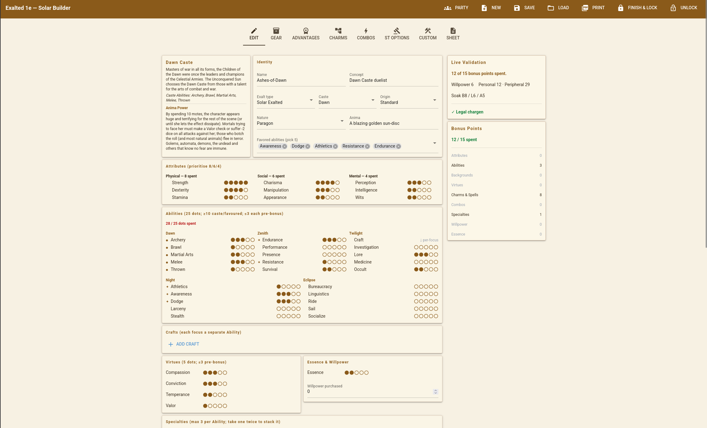
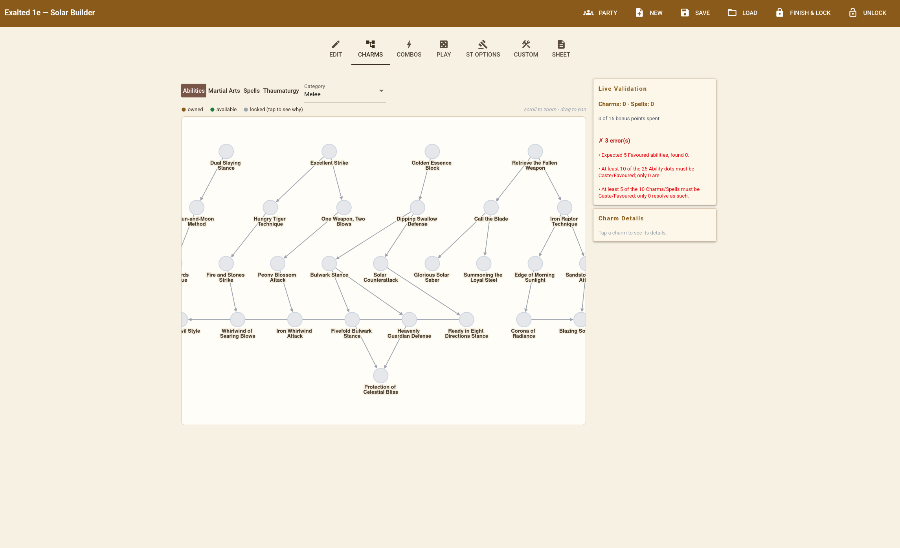
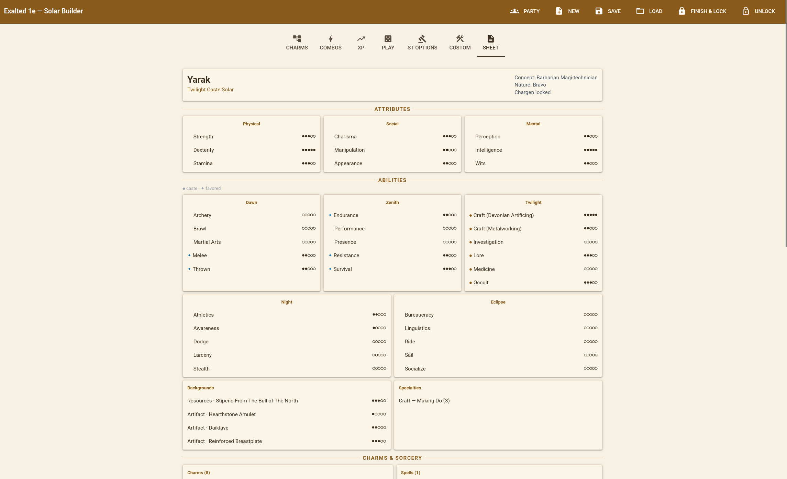
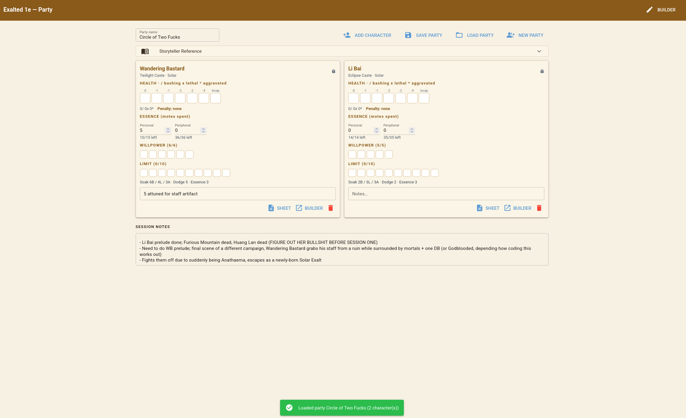

# Exalted 1e Character Builder

Welcome to my project. This is a desktop character builder, validator, and
play tracker for White Wolf's Exalted 1E. It primarily deals with chargen but also has
XP advancement and an ST/Party point of view.

I was annoyed at the lack of resources for Exalted 1E, and made this because of it.
Anathema is long since dead, and every existing tool targets 2/.5E or 3E or Essence. I do
not play any of these, so I have deliberately excluded anything that is not in a 1E book.
If you like 2.5E more and want it to support that, fork the project. Docs should be good
enough to help you modify it to your liking.

The chargen rules, xp rules, etc etc all live in JSONs under data/, not in the Python code.
There are 1,709 Charms, 92 spells, 18 Martial Arts styles (plus the ten Dragon-Kings Paths),
full cost/budget tables, equipment lists and more all there, sorted into their own JSONs. Engine
is modular and split off from the UI, and contains no I/O -- and the UI is similar in that it
has no game logic of its own. In practice, this makes it much easier to add homebrew Charms,
Spells, or Martial Arts (see [Homebrew](#homebrew)).

> Fan project, unaffiliated with White Wolf / Onyx Path. Exalted is their
> intellectual property; this is a tool for people who own the books.

## Screenshots






## What's supported

Every **Exalted** splat, complete — chargen, Charms, advancement and UI:

| Splat | Charms | Notes |
|---|---:|---|
| Solar | 381 | Core plus all five castebooks, and the Cult of the Illuminated origin |
| Dragon-Blooded | 325 | Dynastic and Outcaste, the Immaculate Order path, all five Aspect Books |
| Abyssal | 233 | Necromancy, the five Deathlord castes |
| Lunar | 217 | Attribute-keyed Charms, Deadly Beastman Transformation, the Gift menu |
| Sidereal | 193 | Astrological Colleges, Sidereal Martial Arts, Paradox |
| Alchemical | 121 | Charm Slots, Arrays, Submodules, Clarity, vat refit |

Plus the non-Exalt splats, all browser-verified:

| Splat | Notes |
|---|---|
| Mortals & Heroic Mortals | One splat, two origins; no Charms, Essence pinned at 1; magic comes via Merits & Flaws |
| Ghosts | 56 Arcanoi across the six paths, Fetters and Passions, two chargen axes |
| Godblooded | The Ghost-Blooded, Half-Caste and Fae-Blooded heritages, plus the God/Demon-Blooded axis and an 80-Charm spirit catalogue |
| Dragon-Kings | The ten Paths of Prehuman Mastery (a rated subsystem, 60 powers), four Breeds, Terrestrial sorcery |
| Mountain Folk | The Enlightenment origin axis and the five-Pattern Charm economy (94 Charms), the Great Geas |

And the subsystems: **Merits & Flaws** (the whole chapter, including the Fae-Blooded
glamour Merits — and the thing that opens Terrestrial Martial Arts and Sorcery to a
mortal), **rated artifacts** (individual artifacts priced against the E:Ab p.131
Artifact budget — damaged artifacts and all — with a catalogue that autofills name and
rating), **Thaumaturgy** (the cross-splat Arts, Sciences, Rituals and Formulas), sorcery
and necromancy at every circle, Combos, Ox-Body and the other repeatable Charms,
per-focus Crafts, magical materials, **Elder Exalts** (Essence bought with XP past 5
raises the trait ceilings — no age chart — with a downtime XP calculator), a **GM
adversary roster** (49 generic extras, beasts and NPCs), and a manual in-play tracker
for motes, health, Willpower and Limit.

**All ten splats are in.** The only thing not supported is the **Fae** — permanently
out of scope, and they can go fuck themselves, as ever.

## Features

* Chargen validated against the sourcebooks with live, in-app validation of characters.
* Editing and XP are one surface: the same dot tracks buy at chargen and spend
  experience after the lock, against an append-only ledger the engine audits against a
  frozen chargen snapshot — so the sheet can always show how the character was paid for
* An interactive Charm tree (Cytoscape) that draws prerequisites, including the ones
  reaching in from other Ability trees, and marks what you can afford right now
* Combo and Array builders, priced by the engine
* **Merits & Flaws** — the whole chapter, calculated in one place; the mortal route to
  Terrestrial Martial Arts and Sorcery
* **Rated artifacts** — artifacts as rated objects against the Artifact budget, with
  damaged-artifact rules
* **Elder Exalts** — Essence bought with XP past 5 raises the trait ceilings, plus a downtime XP calculator
* A **GM adversary roster** — generic extras, beasts and NPCs, instanced and ready for
  the Storyteller page
* A read-only character sheet view, and a Storyteller party page tracking the whole
  group at once
* An in-play tracker for motes, marked health, temporary Willpower and Limit, kept
  strictly out of the validation and XP maths
* Your own Charms, styles and spells, authored in the app; again, see [Homebrew](#homebrew)
* One double-click executable, no Python install needed, no internet at runtime
* Characters and parties save as plain, readable, hand-editable JSON

## Install and run

**The easy way:** grab the executable for your platform from
[Releases](../../releases) and double-click it. It starts a local server and opens
your browser. Nothing to install; no network access at any point.

**From source** (needs Python 3.11+ installed system-wide):

```bash
git clone https://github.com/x6568tank/exalted-1e-charsheet-generator
cd exalted-1e-charsheet-generator
./linux.sh          # or windows.bat on Windows
```

Either script creates `.venv`, installs the app, and builds `dist/ExaltedBuilder`.
Build details, platform caveats and the no-cross-compiling rule are in
[`pack/BUILD.md`](pack/BUILD.md).

**To run it without packaging:**

```bash
python3 -m venv .venv
.venv/bin/python -m pip install -e ".[ui]"
.venv/bin/python -m exalted_builder.ui.builder      # then open http://localhost:8080
```

**Tests:** `.venv/bin/python -m pytest`

## Homebrew

Your own content lives in a `custom/` folder beside the app -- never mixed into the
shipped rules -- and is merged over them at startup. The **Custom** tab writes it for
you: dropdowns for everything the rules constrain, a live JSON pane to copy content
out of or paste it into, and an importer for a whole file of it.

A complete Charm is short. This is the entire definition of a working one:

```json
{
  "id": "custom.house-strike",
  "name": "House Strike",
  "category": "melee",
  "type": "Supplemental",
  "min_ability": 3,
  "min_essence": 2,
  "cost": {"motes": 4},
  "duration": "Instant",
  "description": "Add the character's Essence in dice to a single melee attack.",
  "source": {"book": "Homebrew"}
}
```

A new Martial Arts style needs nothing more than a category nobody has used yet:
`"category": "martial_arts:white-crane"` gives you a White Crane Style tree in the
picker, grouped and drawn like any printed one.

Three things worth knowing:

* **A mistake in your homebrew can never break the app.** A bad row is dropped and
  the reason is shown on the Custom tab; only the shipped rules data is treated as
  fatal.
* **Your content is marked as yours** — on the sheet and in the picker; so nobody
  mistakes it for something out of a book.
* **It travels with the character.** A save carries the definitions it depends on, so
  handing your character to another player hands them your Charms and Spells too.

## Design goals

* **The rulebook is data.** Charms, spells, costs, budgets and equipment are JSON.
  Adding printed content usually means adding data.
* **The engine is pure.** Validation and derivation are functions of
  (rules, character) -- no I/O, no mutation, no UI. The interface holds zero game
  logic and can be thrown away and rewritten.
* **Rules data and character data are separate.** The books are read-only; the save
  file is yours. Characters reference rules by id.
* **Faithful to the page, not to what feels right.** Values come from the 1e books.
  Where the books are ambiguous or errata'd, the ambiguity is recorded rather than
  quietly resolved.
* **Honest about the cracks.** A new *splat* is not just data — every one shipped so
  far needed engine work for its own subsystem (Charm Slots, Colleges, Attribute-keyed
  Charms, Virtue-keyed Arcanoi, the heritage axis). The data-driven promise covers
  content, not mechanics nobody has modelled yet.
* **NO FUCKING DICE.** I will not be modeling any sort of dice-rolling into this.
  If I do, kill me. This is not, and will not, be a CRPG. This is a character builder
  and tracker, and *nothing else*.

## Project structure

```
exalted_builder/
    data/           The rulebook as JSON: charms/, spells, castes, costs, budgets, gear
    models/         Pydantic shapes for the rules and for a character. Structure only —
                    non-negative ratings, valid enums — never game legality
    engine/         Where the rules live: validate, derive, costs, advancement, refit.
                    Pure functions of (RuleSet, Character)
    rules_db.py     Loads data/ into an immutable RuleSet and link-checks it
    custom_content.py   The user's homebrew library: paths, authoring, import/export
    persistence.py  Character and party save files
    ui/             NiceGUI frontend — builder, Charm picker, sheet, party page. No rules
docs/status/        What is built, splat by splat
pack/               PyInstaller packaging and build instructions
tools/              Data authoring spec and a validator for hand-written Charm files
tests/              ~2,068 tests, engine-first
```

Dependencies run one way only: `ui → engine → models`.

## Documentation

* [`docs/ARCHITECTURE.md`](docs/ARCHITECTURE.md) — how it actually works: the module
  boundaries, the two data domains, the chargen/XP lifecycle, and the invariants to not
  break. Start here if you want to modify it
* [`docs/status/`](docs/status/) — the build log, one file per splat or subsystem:
  what is implemented, which pages it came from, and the rulings behind it. Mostly
  kept track of by Claude; I'm a lazy fuck.
* [`CLAUDE.md`](CLAUDE.md) — the working brief: edition rules, workflow, and decisions
  not to relitigate
* [`docs/content.md`](docs/content.md) — the rules data: how `data/` is organised, id
  and category conventions, AND-of-OR prerequisites, what the loader checks
* [`docs/decisions/`](docs/decisions/) — why it is built this way, one numbered record per
  closed decision (including the ones about what this will never do)
* [`docs/adding-a-splat.md`](docs/adding-a-splat.md) — what implementing a splat actually
  takes, based on the ten that are done rather than on wishful thinking
* [`tools/CHARM_AUTHORING_SPEC.md`](tools/CHARM_AUTHORING_SPEC.md) — how to
  transcribe Charms from a page into `data/`, mechanically
* [`pack/BUILD.md`](pack/BUILD.md) — packaging the desktop executable

## Contributing

Bug reports and 1e rules corrections are welcome, especially with a book and page
number. Two ground rules:

1. **1e values only.** 2e is far better represented online, so a "correction" that is
   really a 2e number is the most common way this project would get worse. Cite the
   page.
2. **No rulebook text or scans in the repo.** `sources/` and `images/` are gitignored
   and stay that way.
