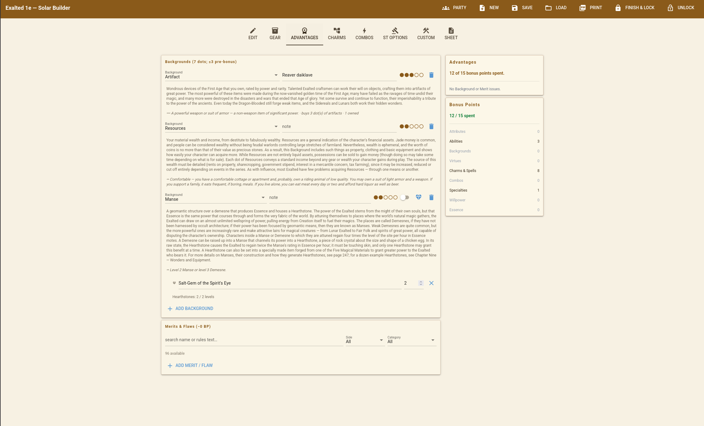
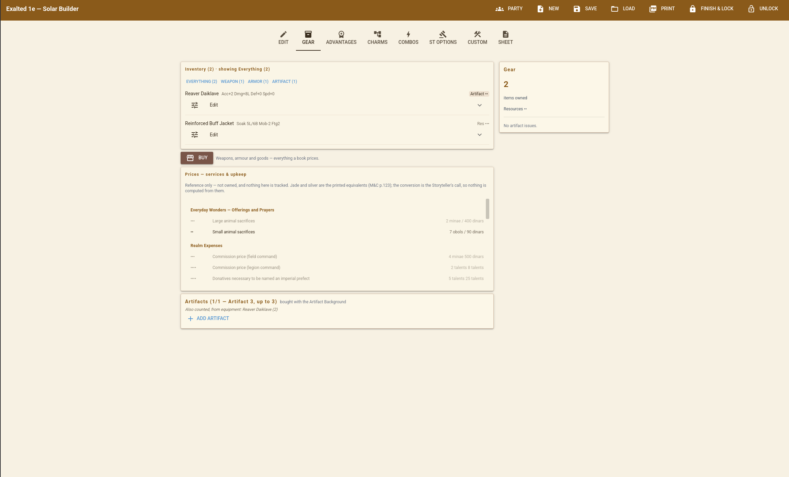
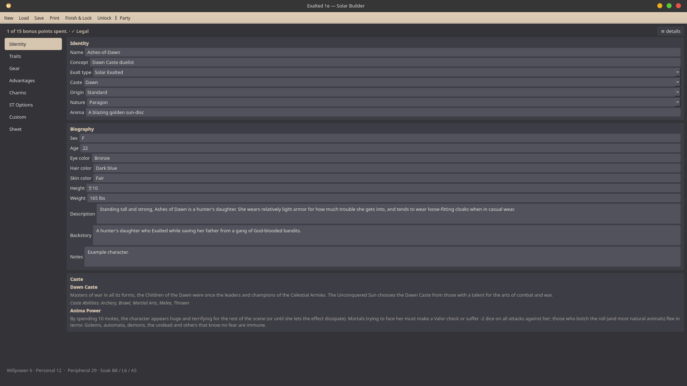
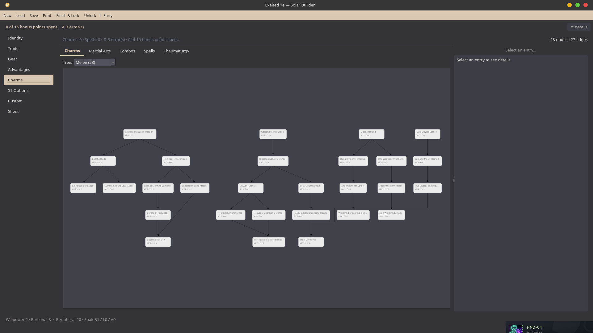
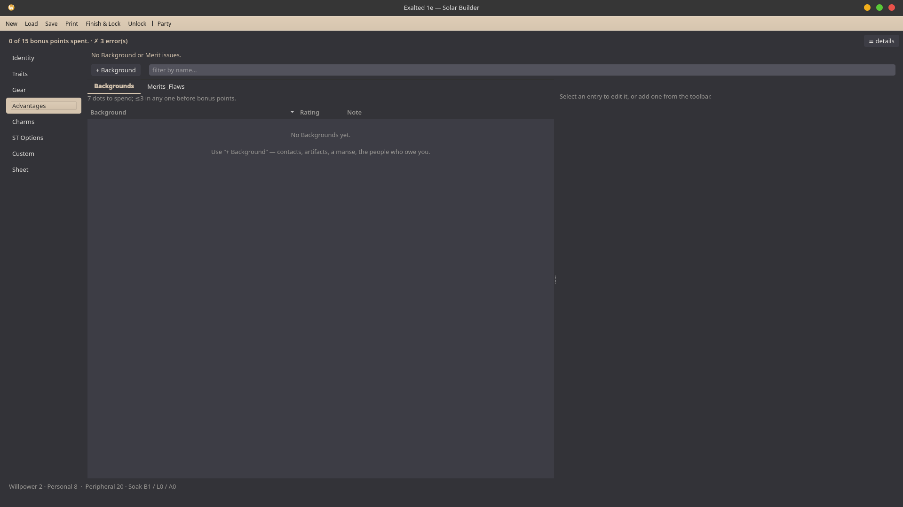
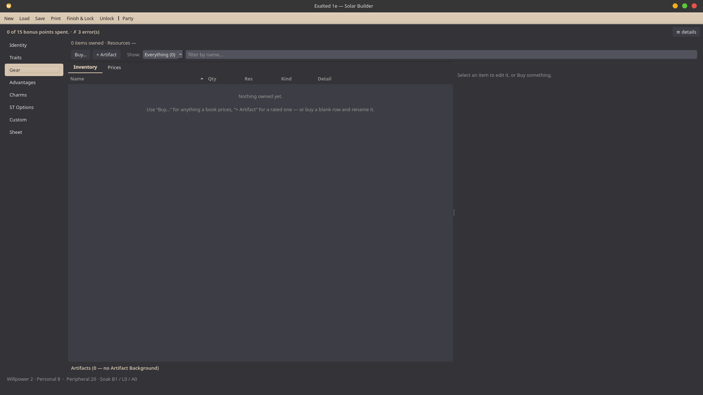
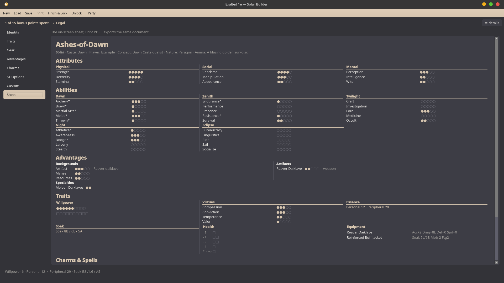
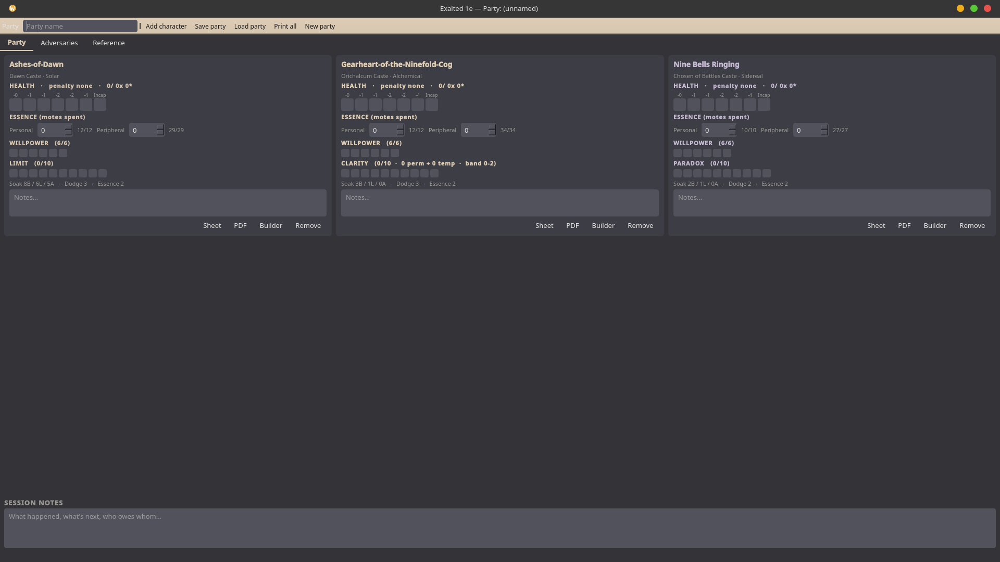

# Lytek's Polishing Cloth -- Person Printing Technique for Exalted 1E
*It's like Chummer, but for Exalted 1E. Character generator, validator, tracker, whatever.*

It does chargen, it does XP advancement afterwards, it prints a sheet, and
it gives the ST a page to watch the whole party from. Put it on a server and it also
runs a campaign: accounts, a shared table, a log with rolls in it, initiative, and a
whiteboard to draw on.

**Try it here:** [exalted.x6568tank.com](https://exalted.x6568tank.com).
I have it hosted on a computer I own! You get the character builder, storage for your
fellers, and campaigns. Or grab one of the downloadable builds and keep it yourself.
Characters are completely cross-compatible, after all.

I made this because I was annoyed. Anathema is long dead and every tool still standing
targets 2E, 2.5E, 3E or Essence. I don't play any of those, so I started working on this for 1E alone.
If you want 2.5E, fork it. The docs are good enough to let you.

There are 1,921 Charms and Arcanoi, 306 spells, 330 rated artifacts, 21 Martial Arts styles
plus the ten Dragon-Kings Paths, 170 Merits and Flaws, the cost and budget tables, 117 weapons,
28 pieces of armour and 93 rows of mundane gear. The engine is pure functions and does no I/O;
the UI holds no game logic. That's mostly so *I* can add content without touching code,
but it means you can too. See [Homebrew](#homebrew).

> Fan project, unaffiliated with White Wolf / Onyx Path. Exalted is their intellectual
> property. This is a tool for people who own the books.

**AI DISCLAIMER**: Parts of this were coded with AI. Opus is a better programmer but I am,
rather fortunately, a better designer.

## Screenshots

### The website (NiceGUI)






### The desktop app (PySide6/Qt)








## Install and run

**The easiest way:** don't. Use [the hosted site](https://exalted.x6568tank.com).

**The easy way:** grab `ExaltedBuilderQt` for your platform from
[Releases](../../releases) and double-click it. It's a native window, not a browser.
Nothing to install, and it never touches the network. Same rules and same save files
as the website, so a character moves between the two freely.

Older releases also shipped a browser build (`ExaltedBuilder`). That's retired;
if you prefer the browser look, that's what the website is for.

**From source** (needs Python 3.11+ installed system-wide):

```bash
git clone https://github.com/x6568tank/exalted-1e-charsheet-generator
cd exalted-1e-charsheet-generator
./linux-qt.sh      # or windows-qt.bat on Windows
```

The script makes `.venv`, installs the app and builds `dist/ExaltedBuilderQt`.
Platform caveats and the no-cross-compiling rule are in [`pack/BUILD.md`](pack/BUILD.md).

**Run it without packaging:**

```bash
python3 -m venv .venv
.venv/bin/python -m pip install -e ".[qt]"
.venv/bin/python -m exalted_builder.qt [path/to/foo.character.json]
```

For working on the web side, `pip install -e ".[ui]"` and
`python -m exalted_builder.ui.builder` run the NiceGUI builder locally at
http://localhost:8080, no account needed. It's a dev tool now, not something that ships.

**Tests:** `.venv/bin/python -m pytest` — somewhere over 4,000 of them, and a good
twenty minutes. Expect them all to pass. If you don't have optional modules
installed, the tests for them skip themselves. Some checks compare the shipped text against
the rulebook chapters, which are gitignored and don't come with a clone,
so they skip what they can't see. [`docs/testing.md`](docs/testing.md) explains why the count moves.

## Making your first character

Say a Zenith Caste Solar. Open the app and you land on **Edit**.

**Pick the Exalt type before anything else.** Everything downstream comes from it:
your chargen budgets, the caste list, which Charms exist, which Backgrounds you're
allowed. Change it later and you're rebuilding. Then caste, name, concept, Nature.
A few splats ask a second question right there — a Dragon-Blooded's upbringing, a
mortal's heroic-or-ordinary, a Mountain Folk's Enlightenment — and it moves the
numbers as much as the caste does, so answer it before you start spending.

Now work down the page. Every panel tells you what you've got left, in its own header:

```
Attributes (prioritise 8/6/4)
Abilities (25 dots; ≥10 caste/favoured; ≤3 each pre-bonus)
```

Click a dot to set a rating. Click the dot you're already on to drop one, or a lower
dot to drop straight to it.
Attributes are prioritised across the three categories, then Abilities, Virtues,
Essence and Willpower, then Specialties at the bottom.

Backgrounds and Merits & Flaws are on **Advantages**. Anything the character owns is
on **Gear**. Charms are on **Charms**, along with everything else Charm-shaped —
spells, Arcanoi, Thaumaturgy, Martial Arts, Dragon-King Paths, Elemental powers. A
toggle at the top of that tab switches between them.

The Charms subtab draws a **tree, not a list**. Prerequisites are arrows, including the ones
reaching in from a different Ability's tree, and anything you qualify for and can
afford right now is marked. Click to buy, click again to sell back. Your caste and
favoured Charms are already priced as such.

**Combos** is its own tab, empty until you have Charms to put in one. Alchemicals get **Arrays**
in the same spot instead. Ghosts get neither, and the tab isn't there at all — the dead may never learn Combos.

### Watching the column on the right

Two cards, updating on every click:

```
LIVE VALIDATION
7 of 15 bonus points spent.
Willpower 7      Personal 16  ·  Peripheral 40
Soak  B4 / L2 / A0
✗ 2 error(s)
• Ability 'Occult' above 3 without bonus points
• Fewer than 5 caste or favoured Charms

BONUS POINTS
7 / 15 spent
  Attributes        4
  Abilities         3
  Backgrounds       0
```

The bonus points are spent **for you** — the engine finds the cheapest legal way to
pay for whatever you've drawn, and the breakdown shows where they went. You never
allocate them by hand.

Validation errors while you work is fine and expected.

### Finishing

**Finish & Lock** ends chargen. It won't stop you locking a character that still has
errors — it warns you, and the Sheet lists them. Your circle, your call. **Unlock**
puts it back if you jumped early.

## After chargen

Nothing moves. You're on the same tabs, using the same dot tracks — they spend
**experience** now instead of chargen points. Click a dot up and it comes out of your
XP. Click one down and it asks which you meant: undoing a purchase you regret, or a
permanent loss the story inflicted — a curse, Paradox, whatever happened at the table.

Your chargen *choices* lock: caste, splat, favoured picks, origin, Nature. Still
readable, just greyed out. Everything you'd actually raise in play keeps moving.

**Adjust XP** in the right-hand column is where awards go in, with a **Downtime…**
calculator beside it for elder characters. Under those is **Undo last**, naming the
purchase it'll reverse — that's how you take back a Charm, spell, Combo or specialty,
since those have no dot to click back down.

### At the table

**Play** shows up once you're locked. Motes spent, health marked, temporary Willpower,
Limit or Resonance or Clarity as your splat demands. It's manual, all of it, on
purpose.

Down the side is every dice pool the character has, each with its arithmetic laid out,
plus a builder for any Attribute + Ability pair you want. It gives you the base pool
and tells you what it hasn't counted. Then you add your modifiers and roll — on a table
with your hands, or in the dumb roller, which takes a number of dice and a label you
type yourself. It does not know what you're rolling for, and that's deliberate.

## Running a game

**Party** in the header is the ST page: everyone in the group as a card, play state and
notes side by side, plus a roster of adversaries — 58 generic extras, beasts and NPCs
to instance and drop in. Cards touch play state and notes and nothing else. "Builder"
on a card opens that character properly.

**ST Options** holds the per-character toggles: the optional chargen caps, house rules,
permissions like letting a mortal buy an Artifact.

## Playing online

On the hosted site (or your own, see [Self-hosting](#self-hosting)) the same builder
sits behind an account. Your characters live on the server and save themselves; your
homebrew library is yours alone.

**Campaigns** replace the Party page. The Storyteller makes one and hands out a
six-character join code; players ask to join with a character and the ST approves them.
Joining makes a **campaign copy** of the character. That copy is the one that earns XP,
the ST grants it, and your original stays untouched. Leave and you keep the copy.
Spectators join the same way and just watch.

The **table** is the campaign's main page, and everyone at it sees it:

* Every character's play state, health track included.
* A **log** for messages and rolls.
* **Initiative** for the whole table, NPCs too.
* A **Pools** tab with each character's base dice pools.
* Private notes per member. The ST can't read yours.

The ST also gets the adversary roster, NPC sides, the table-wide house rules, and a
campaign homebrew layer that players can propose additions to.

In the middle is **the board**: a shared whiteboard with a pen, an eraser, tokens with
pictures on them, and an uploaded background map. It is a picture of the table, not a
model of it. A token doesn't know which character it is, and it never will.

There's also a **wiki** of rules reference, readable without an account.

## Saving

**Save** in the desktop app writes plain, readable JSON you can hand-edit if you know
what you're doing. The website saves as you go, and **Download a copy** gets you the same
file; importing one on `/home` brings it back.
A party is one file with the characters inside it. A character save also carries any
homebrew it depends on, so handing someone your character hands them your Charms too.

## What's supported

Every **Exalted** splat, complete: chargen, Charms, advancement, UI.

| Splat | Charms | Notes |
|---|---:|---|
| Solar | 441 | Core plus all five castebooks, and the Cult of the Illuminated origin |
| Dragon-Blooded | 336 | Dynastic and Outcaste, the Immaculate Order path, all five Aspect Books |
| Abyssal | 233 | Necromancy, the five Deathlord castes |
| Lunar | 217 | Attribute-keyed Charms, Deadly Beastman Transformation, the Gift menu |
| Sidereal | 193 | Astrological Colleges, Sidereal Martial Arts, Paradox |
| Alchemical | 121 | Charm Slots, Arrays, Submodules, Clarity, vat refit |

And the non-Exalts:

| Splat | Notes |
|---|---|
| Mortals & Heroic Mortals | One splat, two origins. No Charms, Essence pinned at 1; magic comes via Merits & Flaws |
| Ghosts | 127 Arcanoi across thirteen paths plus a common set, Fetters and Passions, two chargen axes |
| Godblooded | Ghost-Blooded, Half-Caste and Fae-Blooded heritages, the God/Demon-Blooded axis, a 90-Charm spirit catalogue |
| Dragon-Kings | The ten Paths of Prehuman Mastery (a rated subsystem, 60 powers), four Breeds, Terrestrial sorcery |
| Mountain Folk | The Enlightenment origin axis, the five-Pattern Charm economy (94 Charms), the Great Geas |

Subsystems on top of that: **Merits & Flaws** (the whole chapter, including the
Fae-Blooded glamour Merits, and the thing that opens Terrestrial Martial Arts and
Sorcery to a mortal), **rated artifacts** (individual artifacts priced against the
Artifact Background, damaged artifacts and all, with a searchable catalogue),
**Hearthstones and Manses**, **Thaumaturgy** (the cross-splat Arts, Sciences, Rituals
and Formulas), sorcery and necromancy at every circle, Combos, Ox-Body and the rest of
the repeatable Charms, per-focus Crafts, magical materials, a **shop and inventory**
for mundane goods, **Elder Exalts** (Essence bought with XP past 5 raises the trait
ceilings, no age chart, with a downtime XP calculator), and the **GM adversary
roster**.

**All ten splats are in.** The only thing not supported is the **Fae**. You may be wondering why. Fuck em,
that's why.

## Homebrew

Homebrew and custom content lives in a `custom/` folder next to the app, never mixed into the shipped
rules, and gets merged over them at startup. The **Custom** tab writes it for you:
dropdowns for everything the rules constrain, a live JSON pane to copy out of or paste
into, and an importer for a whole file at once.

A complete Charm is short. This is a working one, in full:

```json
{
  "id": "custom.house-strike",
  "name": "House Strike",
  "category": "melee",
  "type": "Supplemental",
  "min_ability": 3,
  "min_essence": 2,
  "cost": {"motes": 4},
  "duration": "Instant",
  "description": "Add the character's Essence in dice to a single melee attack.",
  "source": {"book": "Homebrew"}
}
```

A new Martial Arts style needs nothing but a category nobody has used yet.
`"category": "martial_arts:white-crane"` gets you a White Crane Style tree in the
picker, grouped and drawn like any printed one.

Three things worth knowing:

* **Your homebrew can't break the app.** A bad row is dropped and the reason is shown
  on the Custom tab. Only the shipped rules data is treated as fatal.
* **It's marked as yours,** on the sheet and in the picker, so nobody mistakes it for
  something out of a book.
* **It travels with the character,** as above.

## Self-hosting

The server is one process with the `server` extra:

```bash
.venv/bin/python -m pip install -e ".[server]"
export EXALTED_SESSION_ROOT=/some/folder/sessions     # characters, homebrew, campaigns
export EXALTED_DB_PATH=/some/folder/exalted.db        # accounts
export EXALTED_STORAGE_SECRET=something-long           # keep it; a new one logs everyone out
.venv/bin/python -m exalted_builder.server.main --host 0.0.0.0 --port 8080
```

Run **one** worker; the live characters are held in memory. The login cookie is
`Secure`, so it needs HTTPS in front of it — a plain-HTTP address can't log anyone in.
There's a [`Dockerfile`](Dockerfile), and [`docs/deploy/homeserver.md`](docs/deploy/homeserver.md)
has the Compose entry and the update steps. Accounts are managed from the command line:
`python -m exalted_builder.server.users list | reset <name> | delete <name>`.

## Design goals

* **The rulebook is data.** Charms, spells, costs, budgets and equipment are JSON.
  Adding printed content usually means adding data and nothing else.
* **The engine is pure.** Validation and derivation are functions of (rules, character).
  No I/O, no mutation, no UI. The frontend holds zero game logic and could be thrown
  away and rewritten tomorrow.
* **Rules data and character data stay apart.** The books are read-only; the save file
  is yours. Characters reference rules by id.
* **Faithful to the page, not to what feels right.** Values come off the 1E books.
  Where the books are ambiguous or errata'd, the ambiguity gets recorded instead of
  quietly resolved.
* **There is a dumb dice roller, and a dumb board.** It has a label, and you input how many dice. I will
  not do charm effects for you, fuck off. The board is a whiteboard with tokens; it
  doesn't know who anyone is, and it doesn't measure range. This is not, and will not be,
  a CRPG or a VTT that plays the game for you. It is a character builder and tracker and
  a table to sit at, and *nothing else*.

## Project structure

```
exalted_builder/
    data/           The rulebook as JSON: charms/, spells, castes, costs, budgets, gear
    models/         Pydantic shapes for the rules and for a character. Structure only:
                    non-negative ratings, valid enums. Never game legality
    engine/         Where the rules live: derive, costs, advancement, refit, and
                    validate/ — the legality checks, split by domain. Pure functions
                    of (RuleSet, Character)
    rules_db.py     Loads data/ into an immutable RuleSet and link-checks it
    custom_content.py   The homebrew library: paths, authoring, import/export
    persistence.py  Character and party save files
    ui/             NiceGUI frontend: builder, Charm picker, sheet, party page. No rules
    qt/             The native PySide6 frontend. Same engine, same saves
    server/         The hosted site: accounts, the login gate, per-account characters
                    and homebrew, campaigns, the table, the board, the wiki
docs/status/        What is built, splat by splat
docs/plans/         Designs and build logs for the bigger pieces (hosting, campaigns, board)
pack/               PyInstaller packaging and build instructions
tools/              Data authoring spec and a validator for hand-written Charm files
tests/              4,000-odd tests, engine-first
```

Dependencies run one way only: `ui`/`qt`/`server → engine → models`.

## Documentation

* [`docs/ARCHITECTURE.md`](docs/ARCHITECTURE.md) — how it actually works: module
  boundaries, the two data domains, the chargen/XP lifecycle, and the invariants not to
  break. Start here if you want to modify it
* [`docs/status/`](docs/status/) — the build log, one file per splat or subsystem: what
  is implemented, which pages it came from, and the rulings behind it. Mostly kept by
  Claude; I'm a lazy fuck
* [`CLAUDE.md`](CLAUDE.md) — the working brief for agents: edition rules, workflow, and the
  decisions not to relitigate
* [`docs/content.md`](docs/content.md) — the rules data: how `data/` is organised, id
  and category conventions, AND-of-OR prerequisites, what the loader checks
* [`docs/decisions/`](docs/decisions/) — why it's built this way, one numbered record
  per closed decision, including the ones about what this will never do
* [`docs/adding-a-splat.md`](docs/adding-a-splat.md) — what implementing a splat
  actually costs, based on the ten that are done rather than on wishful thinking
* [`tools/CHARM_AUTHORING_SPEC.md`](tools/CHARM_AUTHORING_SPEC.md) — how to transcribe
  Charms off a page into `data/`, mechanically
* [`pack/BUILD.md`](pack/BUILD.md) — packaging the desktop executables, web and native
* [`docs/plans/vtt.md`](docs/plans/vtt.md) — the hosted table and the board: what they
  are, what they will never be, and why the board was cheap
* [`docs/deploy/homeserver.md`](docs/deploy/homeserver.md) — running the server in a
  container

## Contributing

Bug reports and 1E rules corrections are welcome, especially with a book and a page
number. Two ground rules:

1. **1E values only.** 2E is far better represented online, so a "correction" that's
   really a 2E number is the single most likely way this project gets worse. Cite the
   page.
2. **No rulebook text or scans in the repo.** `sources/` and `images/` are gitignored
   and they stay that way.
